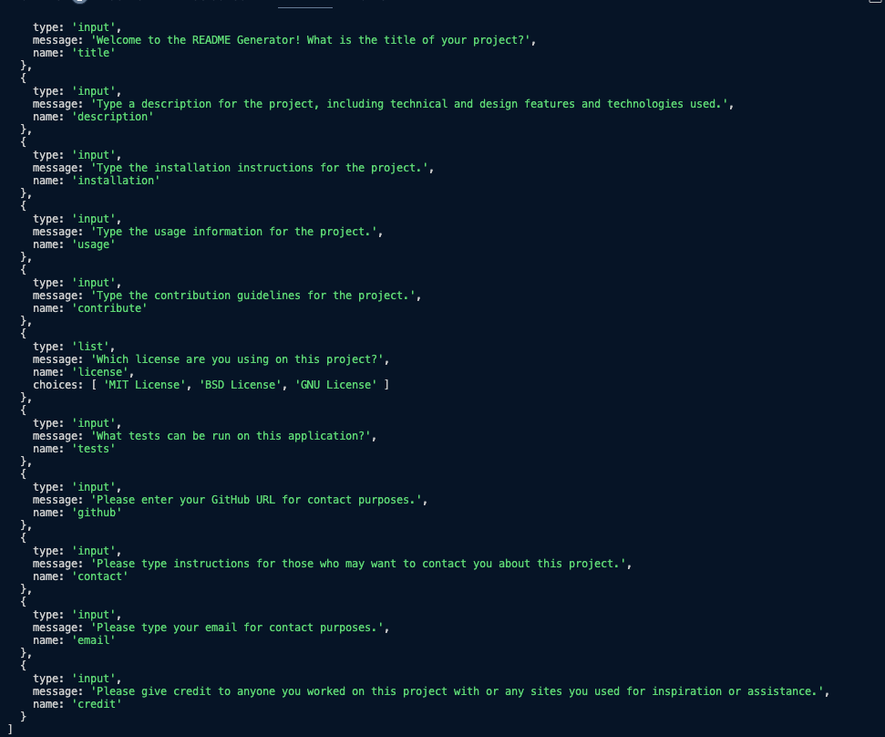

# README-Generator

## Description

A command line tool for creating quick, quality README's. This tool is file is used solely on the command line and outputs a README.md. The user is asked a series of questions via inquirer npm and the answers are put into a README template. 📑

## Table of Contents

1. [Installation](#1.)
2. [Usage Information](#2.)
3. [Contributing](#3.)
4. [License](#4.)
5. [Questions](#6.)
6. [Credit](#7.)

#

## 1. Installation 💻

To install this, clone the repo onto your local environment. Open the file in a code editor with a integrated terminal and run the command "npm i". Then run "node index.js" and answer the command prompts thoroughly as they appear. 

#

## 2. Usage Information 📸

#

## 3. Contributing 🫴🏼

To contribute  to this project, use the contact information below to content the creator - Lillian Edwards

#

## 4. License 🪪

MIT License
[License: MIT](https://opensource.org/licenses/MIT)

 

#

## 5. Questions ❓

Here is my GitHub Link: [https://github.com/lillianedwards](https://github.com/lillianedwards)
If you need to contact me: Please email me at the address below 
You can email me at: lillian.edwards63@gmail.com 📧

#

## 6. Credit 🤝🏼

I worked on this project alone, but received help from my tutor/TA, Justin Moore! 

